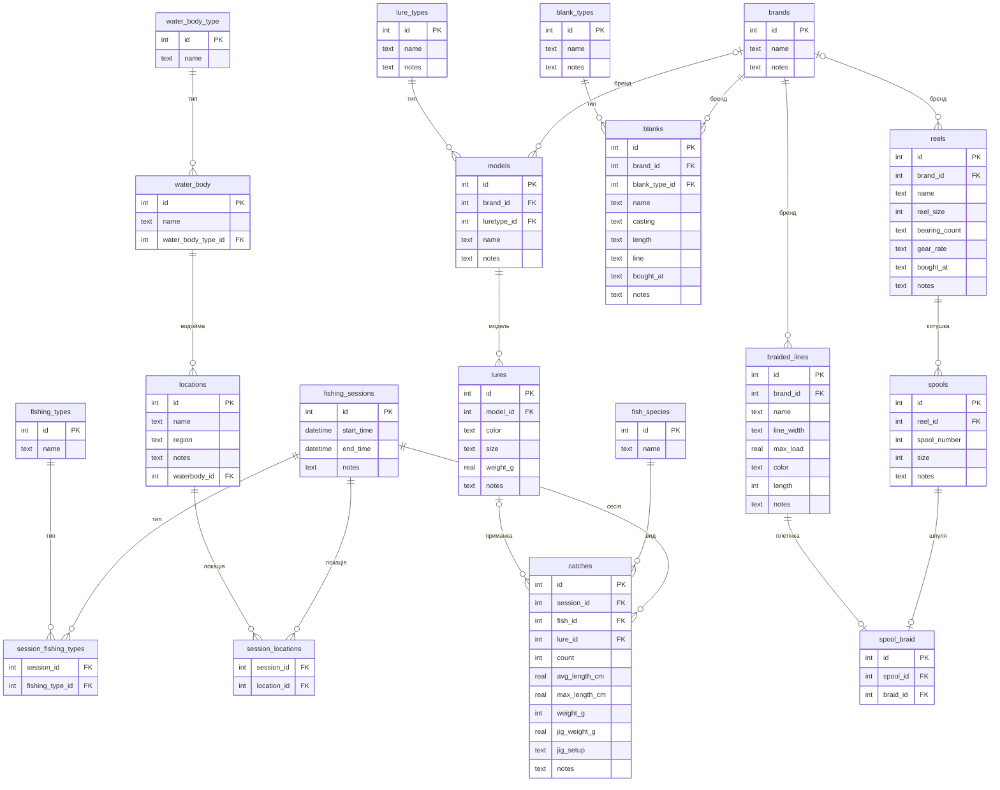

# Схема бази даних

## Примітки до обмежень

| Таблиця | Обмеження |
|---|---|
| `models` | `UNIQUE(brand_id, name)` — унікальність у межах бренду |
| `catches.fish_id` | `ON DELETE RESTRICT` — не можна видалити вид риби, поки є улови |
| `catches.session_id` | `ON DELETE CASCADE` — улови видаляються разом із сесією |
| `catches.lure_id` | `ON DELETE SET NULL` — улов зберігається при видаленні приманки |
